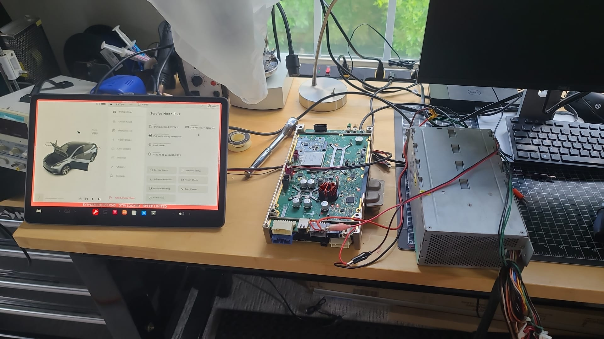

# Tesla MCU-Reverse Engineering
---
I have begun reverse engineering by creating high quality photos of the front and back of the HW2.5 and HW3.0 MCU. Each image is 6 images stitched together so there may be some small issues. Open the full size images and zoom, you can make out values for every resistor and part numbers for almost all ICs. I created these high quality images to overlay pin-outs, part numbers, traces, compare versions, and attach datasheets. Eventually, I'll probably add photos for the Autopilot and LTE boards, but making these photos takes a long time.

---

### HW 2.5
Front

Back

---

### HW 3.0
Front

Back

---

### MCU and CID
