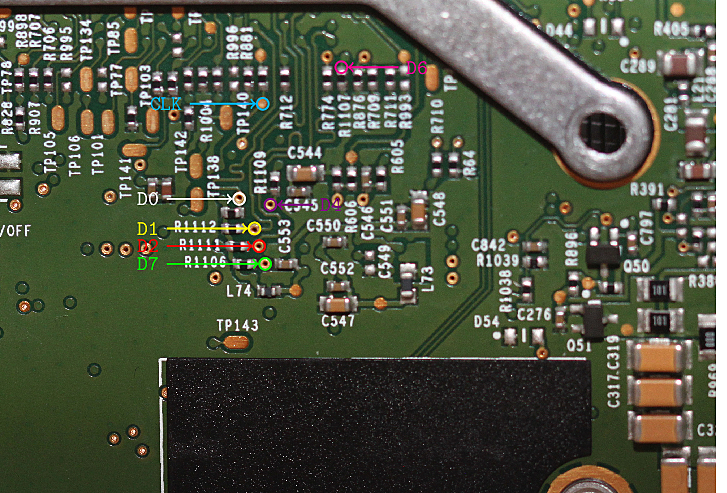
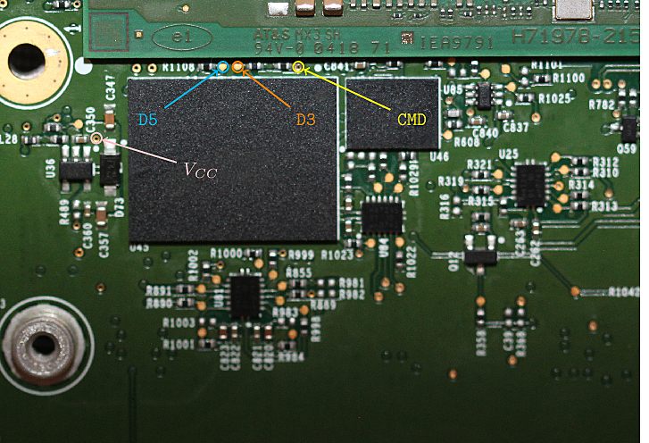
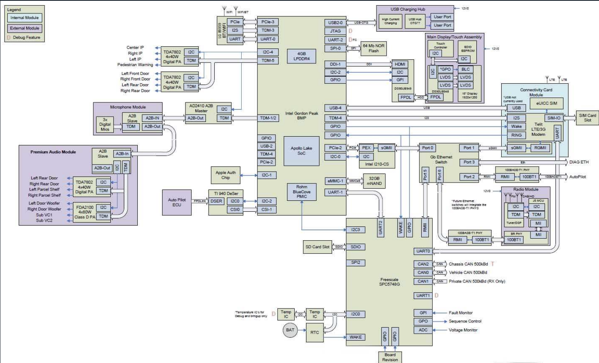
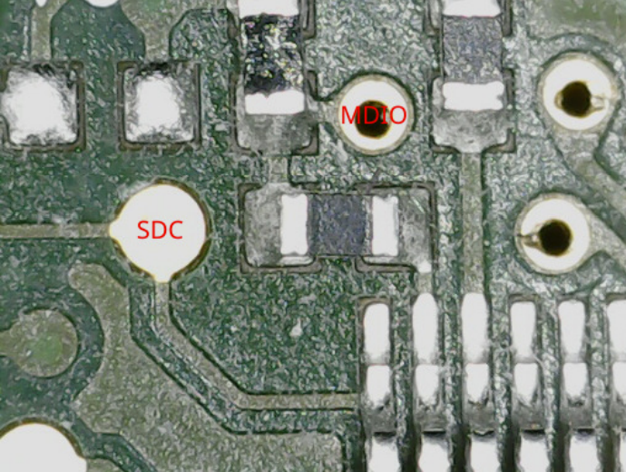

# Tesla MCU-Reverse Engineering
---
I have begun reverse engineering by creating high quality photos of the front and back of the HW2.5 and HW3.0 MCU. Each image is 6 images stitched together so there may be some small issues. Open the full size images and zoom, you can make out values for every resistor and part numbers for almost all ICs. I created these high quality images to overlay pin-outs, part numbers, traces, compare versions, and attach datasheets. Eventually, I'll probably add photos for the Autopilot and LTE boards, but making these photos takes a long time.

---

### HW 2.5
Front

Back

---

### HW 3.0
Front

Back

---

### MCU and CID

---

# Research

A compilation of links with valuable information. Just a short summary of each for now, but I will add how I think this information could be combined leveraged for greater access. I've spent countless hours researching this information, hopefully this can help someone and lower the barrier for entry.

Something interesting I've found: holding the eMMC clock pin to ground seems to cause the MCU to boot into a recovery mode. This allows connection to IP 192.168.1.101, and new ports are open. I suspect this opens something useful that could be exploited, but I will need to dump the firmware for more information.

Tesla Hardware Overview (2020)
\
https://www.pentestpartners.com/security-blog/reverse-engineering-tesla-hardware/

Tesla Firmware Update Process (2020)\
https://www.pentestpartners.com/security-blog/reverse-engineering-the-tesla-firmware-update-process/

Log Reverse Engineering (2021)\
https://gitee.com/mirrors_d4l3k/teslalogs

Gateway Configuration Values (2022)\
https://pastebin.com/F9MfAKgp

Beginner Documentation on Reverse Engineering Model S MCU (2020)\
https://github.com/Lunars/tesla/wiki

Information on MCU Firmware Dumping (2020)\
https://github.com/lewurm/blog/issues

0-Click RCE on Model 3 (2022)\
https://www.synacktiv.com/sites/default/files/2022-10/tesla_hexacon.pdf

Loads of valuable information, Synacktiv rocks!

Security of Connected Vehicles (2023)\
https://www.synacktiv.com/sites/default/files/2023-06/SecuriteDesVoitures.pdf

Synacktiv rocks again, great information on managing the ethernet switch to remove all firewalls on the internal ethernet network.

